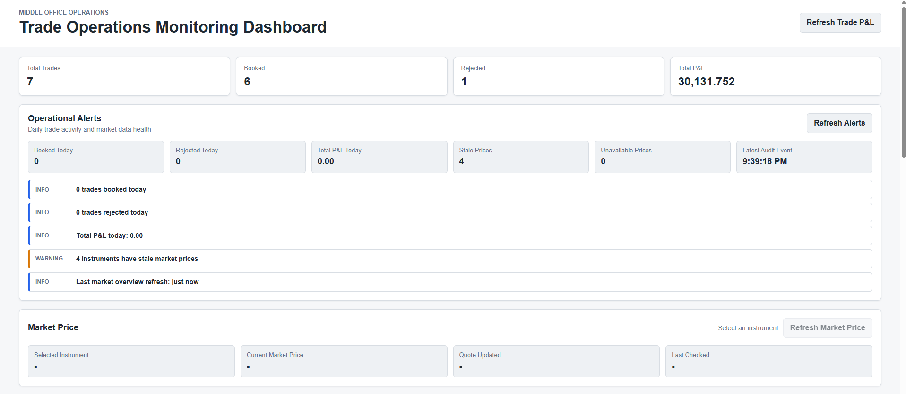
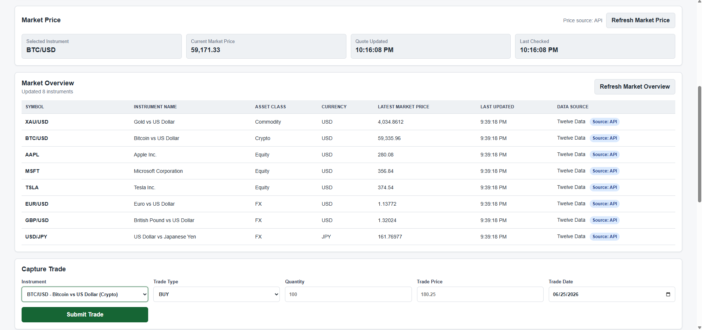
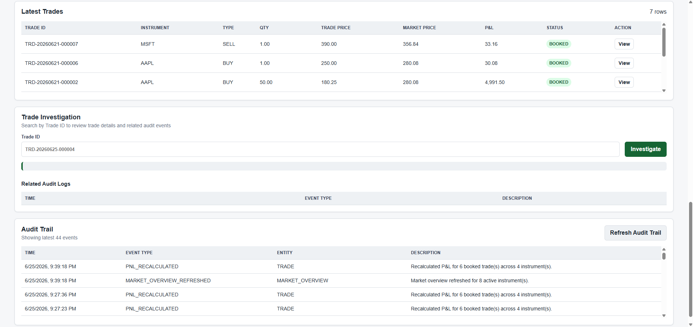
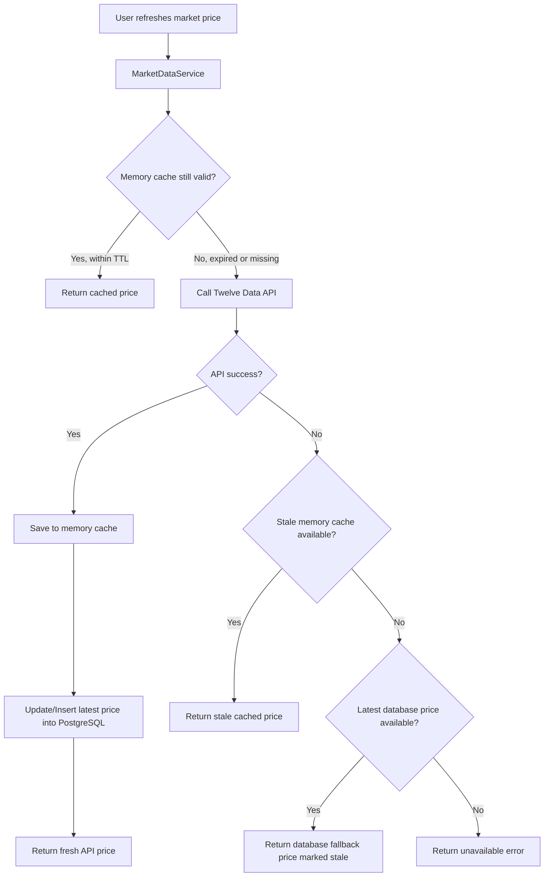

# Trade Operations Management System

A full-stack mini trade operations management system that simulates a simplified capital markets middle-office workflow.

The application allows users to monitor daily trade activity, identify rejected trades, detect stale market data, review operational alerts, investigate trade issues, and track P&L from a simple dashboard.

## Purpose

This project simulates a trade operations management system used by middle-office or support analysts to monitor booked/rejected trades, market data health, P&L, and audit events.

It was built to demonstrate backend API development, SQL/database design, business rule validation, financial calculation logic, market data monitoring, auditability, and operational reporting - concepts commonly found in banking, capital markets, ERP, and financial technology systems.

## Real-World Use Case

A trade operations analyst opens the dashboard every morning to check daily trade activity.

They review booked and rejected trades, scan operational alerts, investigate rejected trades or stale market data, and use audit logs to understand what happened.

The goal is to simulate the type of support tool used by middle-office teams to monitor trade flow after capture and quickly spot issues requiring follow-up.

## Features

- Create financial trades
- Auto-generate trade IDs using the trade date
- Load active instruments from a PostgreSQL reference table
- Select instruments from a frontend dropdown
- Fetch latest market prices from a configurable market data provider
- View a Market Overview watchlist for all active instruments
- Refresh selected instrument market price on demand
- Refresh trade P&L and market prices on demand
- Persist the latest known market price per instrument in PostgreSQL
- Track simplified trade lifecycle statuses: NEW, VALIDATED, BOOKED, REJECTED
- Store audit logs for trade, market data, and P&L events
- View full trade details from the Latest Trades table
- Monitor operational alerts for daily trade health
- Search by Trade ID to investigate trade issues
- Validate trade input data
- Validate submitted instruments against backend reference data
- Calculate P&L for BUY and SELL trades
- Recalculate booked trade P&L when trades are refreshed
- Cache market prices in memory to reduce free API usage
- Fall back to the latest persisted database price if the market data provider is unavailable
- Store trade records in PostgreSQL
- Display trade history
- Show reporting dashboard with total trades, booked trades, rejected trades, and total P&L
- Embedded AI Trade Operations Copilot opened from a floating right-side button
- Ask the copilot about the dashboard, trade concepts, available instruments, rejected trades, stale market data, audit logs, and P&L
- Store AI Copilot questions, answers, source endpoints, row counts, and errors in PostgreSQL
- Responsive frontend for laptop and mobile

## AI Trade Operations Copilot

The dashboard includes an embedded AI Trade Operations Copilot. It appears as a floating `Ask Copilot` button and opens a right-side assistant panel without disrupting the main workflow.

The copilot is powered by a separate, lightweight FastAPI backend and uses this Node/Express application as its source system. It does not duplicate trade validation, P&L, market data, investigation logic, or interaction history. Instead, it calls the existing API endpoints exposed by this app and writes every AI interaction back through `POST /api/ai-copilot/logs`.

This application and its PostgreSQL database are the single source of truth for operational data and AI question-and-answer history. Centralizing the `ai_copilot_logs` audit trail improves traceability and makes future usage, quality, and error analytics possible without coupling the embedded copilot to its own database.

The assistant supports intent-aware behavior:

- Explains the application when users ask what the system does.
- Explains trade operations concepts such as trades, P&L, rejected trades, audit trail, and stale market data.
- Answers reference-data questions such as available instruments from `GET /api/instruments`.
- Answers operational data questions about rejected trades, market data health, audit logs, P&L, trade investigations, and operations summaries.
- Responds naturally to small-talk/help messages.

Example copilot questions:

- `What is this app about?`
- `What is a trade?`
- `What is P&L?`
- `What are the available instruments to use?`
- `Show today's rejected trades.`
- `Is any market data stale?`
- `Why was trade TRD-20260625-000004 rejected?`

The widget file is served from:

```text
public/trade-ops-copilot.js
```

The page initializes it in `public/index.html`:

```html
<script src="/trade-ops-copilot.js?v=5"></script>
<script>
  window.TradeOpsCopilot?.init({
    apiBaseUrl: "http://127.0.0.1:8000",
    title: "Trade Ops Copilot",
    subtitle: "Middle-office assistant",
    buttonLabel: "Ask Copilot"
  });
</script>
```

To use the copilot locally, run this app on port `3001` and run the copilot FastAPI backend on port `8000`.

## Screenshots

## Operations Dashboard

The Operations Dashboard provides a real-time overview of trade activity, operational alerts, and daily monitoring metrics. It helps middle-office users quickly identify rejected trades, stale market data, and the overall health of the trading system.



## Market Monitoring & Trade Capture

The Market Monitoring section displays live market prices for supported instruments, while the Trade Capture form allows users to submit BUY and SELL trades. The backend validates the selected instrument, retrieves the latest market price, calculates unrealized P&L, and books or rejects the trade.



## Trade Monitoring & Investigation

The Latest Trades table provides an overview of recent trades, while the Trade Investigation section allows operations users to search by Trade ID, review trade details, investigate issues, and analyze related audit events through the Audit Trail.



## Mobile Responsive View

The application was designed to support desktop, tablet, and mobile devices.

Mobile screenshots are available in:

```text
screenshots/mobileView/
```

Included examples demonstrate:

* Responsive dashboard layout
* Mobile trade capture workflow
* Market Overview watchlist on smaller screens
* Responsive data tables
* Touch-friendly interactions
* Adaptive layouts across multiple screen sizes

The interface was tested across desktop and mobile viewports to ensure usability for trade capture, market monitoring, reporting, and audit trail navigation.

---

## Tech Stack

- Node.js
- Express.js
- PostgreSQL
- HTML
- CSS
- JavaScript
- Market data provider: Twelve Data by default

## Setup

1. Install dependencies:

```bash
npm install
```

2. Create a PostgreSQL database named `trade_processing_db`.

3. Run `database.sql` against the database to create tables, seed instruments, seed demo trades, and seed audit events.

4. Create `.env` from `.env.example`:

```env
PORT=3001
DB_USER=postgres
DB_PASSWORD=your_password
DB_HOST=localhost
DB_DATABASE=trade_processing_db
DB_PORT=5432
MARKET_DATA_PROVIDER=twelvedata
MARKET_DATA_API_KEY=your_market_data_api_key
MARKET_DATA_STALE_THRESHOLD_MINUTES=15
```

5. Start the app:

```bash
npm run dev
```

Then open:

```text
http://localhost:3001
```

## API Endpoints

### GET `/api/health`

Returns a simple health-check response confirming the API is running.

### POST `/api/ai-copilot/logs`

Stores an AI Copilot interaction with its question, intent, answer, source API endpoint, row count,
success status, response time, optional model/token usage, and error. The FastAPI copilot calls this
endpoint after each embedded `/agent/ask` request. These fields support future latency, usage,
intent-frequency, token-consumption, and success-rate dashboards.

### GET `/api/ai-copilot/logs`

Returns the newest AI Copilot interaction logs first. Use the optional `limit` query parameter;
the API constrains it to `1-100` and defaults to `50`.

### POST `/api/trades`

Creates a trade, validates it, calculates P&L, and saves it to the database.

The request body does not include market price. The backend fetches the latest available market price and uses it for trade booking.

Trade IDs are generated by the backend using this pattern:

```text
TRD-YYYYMMDD-000001
```

`YYYYMMDD` comes from the trade date selected by the user.

### GET `/api/trades`

Returns all saved trades.

Booked trades are refreshed with latest available market prices and recalculated P&L before being returned.

### GET `/api/trades/:tradeId`

Returns one trade by its generated trade ID.

If the trade does not exist, the API returns `404` with a clean message.

### GET `/api/trades/report`

Returns trade reporting metrics:

- Total trades
- Booked trades
- Rejected trades
- Total P&L

Example:

```json
{
  "TotalTrades": 6,
  "BookedTrades": 5,
  "ValidTrades": 5,
  "RejectedTrades": 1,
  "TotalPnL": "727.5000"
}
```

`ValidTrades` is kept for backward compatibility, while `BookedTrades` is the clearer lifecycle-based field used by the dashboard.

### GET `/api/instruments`

Returns active instruments from the PostgreSQL reference table.

The frontend uses this endpoint to populate the instrument dropdown. The backend also validates submitted instruments against the same table, which simulates instrument/reference-data validation used in financial and trading systems.

### GET `/api/market-price/:symbol`

Returns the latest available market price for an active instrument.

Example:

```json
{
  "symbol": "AAPL",
  "marketPrice": 185.22,
  "source": "twelvedata",
  "timestamp": "2026-06-21T12:00:00.000Z",
  "checkedAt": "2026-06-21T12:00:05.000Z",
  "lastCheckedAt": "2026-06-21T12:00:05.000Z",
  "priceAgeSeconds": 0,
  "freshnessLabel": "Updated 0s ago",
  "cacheAgeSeconds": 0,
  "fromCache": false,
  "fromDatabase": false,
  "stale": false
}
```

### GET `/api/market-overview`

Returns the latest available market prices for all active instruments.

The endpoint loads instruments from PostgreSQL, retrieves prices through the market data service, uses the server-side cache when prices are still valid, and can fall back to the latest persisted `market_prices` row if the external provider is unavailable.

Example:

```json
[
  {
    "symbol": "AAPL",
    "name": "Apple Inc.",
    "assetClass": "Equity",
    "currency": "USD",
    "marketPrice": 185.22,
    "lastUpdated": "2026-06-21T12:45:03.000Z",
    "lastCheckedAt": "2026-06-21T12:45:05.000Z",
    "source": "twelvedata",
    "fromCache": true,
    "fromDatabase": false,
    "cacheAgeSeconds": 43,
    "priceAgeSeconds": 43,
    "freshnessLabel": "Updated 43s ago",
    "stale": false
  }
]
```

### GET `/api/audit-logs`

Returns the latest 50 audit events ordered by newest first.

Example:

```json
[
  {
    "eventType": "TRADE_BOOKED",
    "entityType": "TRADE",
    "entityId": "TRD-20260621-000006",
    "description": "Trade TRD-20260621-000006 passed validation and was booked.",
    "createdAt": "2026-06-21T12:48:00.000Z"
  }
]
```

### GET `/api/operations/summary`

Returns the middle-office operational summary used by the Operational Alerts section.

Example:

```json
{
  "bookedTradesToday": 8,
  "rejectedTradesToday": 2,
  "totalPnLToday": 1240.55,
  "staleMarketDataCount": 1,
  "unavailableMarketDataCount": 0,
  "lastAuditEventAt": "2026-06-25T10:15:00.000Z",
  "latestRejectedTrades": [],
  "alerts": [
    {
      "level": "warning",
      "message": "2 trades rejected today"
    }
  ]
}
```

### GET `/api/operations/investigate/:tradeId`

Returns a trade, related audit logs, and a plain-English investigation summary.

Example:

```json
{
  "trade": {},
  "auditLogs": [],
  "summary": "Trade TRD-20260625-000004 was rejected because quantity must be greater than zero."
}
```

## Operational Alerts

The Operational Alerts section gives a morning-check view for support analysts.

It shows:

- Booked trades today
- Rejected trades today
- Total P&L today
- Stale market data count
- Unavailable market data count
- Latest audit event time
- Alert badges marked as info, warning, or danger

Market data is treated as stale when the persisted latest price in `market_prices` is older than the operational freshness threshold used by the backend.

## Trade Investigation

The Trade Investigation section lets a user search by Trade ID.

It returns:

- Full trade details
- Rejection reason for rejected trades
- Market data source
- Last price update time
- Related audit logs for that trade
- A short investigation summary

This turns the app from a trade capture demo into a support workflow: the analyst can see an issue, search the trade, and review the operational evidence.

## Trade Lifecycle

The project uses a simplified lifecycle to make trade lifecycle management more realistic:

- `NEW`: trade request has been submitted.
- `VALIDATED`: trade passed business validation.
- `BOOKED`: trade was successfully stored as an accepted trade.
- `REJECTED`: trade failed validation or could not be accepted.

For simplicity, the database stores the final status. Accepted trades are stored as `BOOKED`, and failed trades are stored as `REJECTED`. Audit logs record the important workflow events around capture, rejection, booking, market refresh, and P&L recalculation.

## Audit Trail

The Audit Trail section shows recent operational events, such as:

- `TRADE_CREATED`
- `TRADE_VALIDATED`
- `TRADE_REJECTED`
- `TRADE_BOOKED`
- `MARKET_PRICE_REFRESHED`
- `MARKET_PRICE_STALE_FALLBACK_USED`
- `MARKET_PRICE_DATABASE_FALLBACK_USED`
- `MARKET_PRICE_UNAVAILABLE`
- `MARKET_OVERVIEW_REFRESHED`
- `PNL_RECALCULATED`

Market data audit events are used to explain price freshness and fallback behavior:

- `MARKET_PRICE_REFRESHED`: a fresh provider price was fetched and saved.
- `MARKET_PRICE_STALE_FALLBACK_USED`: the provider failed, so the backend returned stale in-memory cache.
- `MARKET_PRICE_DATABASE_FALLBACK_USED`: the provider failed and no memory cache was available, so the backend returned the latest persisted PostgreSQL price.
- `MARKET_PRICE_UNAVAILABLE`: no API price, cache price, or database fallback price was available.

Audit logging is intentionally non-blocking. If writing an audit event fails, the server logs a warning but does not crash the main trade or market data workflow.

## Trade Detail View

Each row in the Latest Trades table has a View button. It opens a simple detail modal showing the full trade record:

- Trade ID
- Instrument
- Trade type
- Quantity
- Trade price
- Market price
- P&L
- Status
- Rejection reason
- Market data source
- Last price updated time
- Trade date
- Created time

## Live Market Data

The dashboard behaves like a simplified trading workstation:

- The Market Overview section shows a watchlist of all active instruments.
- Users can view latest market prices without creating a trade.
- The Market Overview refresh button reloads prices through the backend cache and does not bypass rate-limit protection.
- User selects an instrument from the dropdown.
- The frontend calls `GET /api/market-price/:symbol`.
- The current market price card updates once when the instrument is selected.
- The user can click Refresh Market Price to refresh only the selected instrument.
- The user can click Refresh Trade P&L to refresh stored trade prices and recalculate P&L.
- When a trade is submitted, the backend fetches the latest available market price and uses it to calculate P&L.
- When `GET /api/trades` is called, booked trades attempt to refresh their market price and recalculate P&L.

Market prices are cached server-side and persisted in PostgreSQL to reduce free API usage, survive backend restarts, and avoid blank dashboards when the external provider is unavailable.

## Market Data Cache And Persistence

Cache and persistence behavior:

- Stocks and crypto use a 60-second cache.
- FX pairs and commodities use a 120-second cache.
- Price refreshes are user-triggered, and repeated backend requests reuse cached prices while the cache is valid.
- `timestamp` shows when the quote was last fetched from the provider. `checkedAt` shows when the backend last checked for a price, so it changes on every frontend refresh even when the quote comes from cache.
- `cacheAgeSeconds` shows how old a cached price is, which gives users transparency when a price comes from cache.
- Fresh provider prices are updated/inserted into the `market_prices` table, one row per instrument.
- If the provider fails and a stale in-memory cached price exists, the backend returns the stale cached price instead of crashing.
- If the provider fails and no memory cache exists, the backend tries the latest known PostgreSQL price from `market_prices`.
- Database fallback prices are marked as stale and shown as `Database fallback` in Market Overview.
- The app does not store every market tick. It only stores the latest known price per instrument.
- When refreshing the trades table, the backend fetches one price per unique instrument and reuses it for all trades with that instrument.

Configure market data in `.env`:

```env
MARKET_DATA_PROVIDER=twelvedata
MARKET_DATA_API_KEY=your_market_data_api_key
MARKET_DATA_STALE_THRESHOLD_MINUTES=15
```

Market data fallback flow:



Free market data APIs can have rate limits, delayed data, symbol coverage differences, and daily request limits. The cache and persistence layers simulate real-world rate-limit and resilience handling: users can refresh prices when needed without forcing the backend to call the external provider unnecessarily. If the provider is unavailable, the app can still show the latest known database price marked as stale.

The Market Overview simulates a simplified market watchlist found in financial platforms. It supports market data monitoring alongside trade operations management and P&L tracking. It shows market price, data source, freshness label, and data status such as API, Cache, Database fallback, Stale, or Unavailable.

## Screenshot Recommendations

For a complete portfolio presentation, include screenshots for:

- Operational Alerts
- Trade Investigation
- Market Overview
- Latest Trades
- Audit Trail

## P&L Formula

BUY:

```text
(Market Price - Trade Price) x Quantity
```

SELL:

```text
(Trade Price - Market Price) x Quantity
```

## Project Structure

```text
trade-operations-management-system/
|-- screenshots/
|   |-- audit-trail.png
|   |-- dashboard-overview.png
|   |-- latest-trades.png
|   |-- market-overview.png
|   |-- trade-capture.png
|   `-- trade-detail-view.png
|-- public/
|   |-- index.html
|   |-- styles.css
|   `-- app.js
|-- src/
|   |-- config/
|   |   `-- db.js
|   |-- controllers/
|   |   |-- auditLogController.js
|   |   |-- instrumentController.js
|   |   |-- marketDataController.js
|   |   |-- marketOverviewController.js
|   |   |-- operationsController.js
|   |   `-- tradeController.js
|   |-- routes/
|   |   |-- auditLogRoutes.js
|   |   |-- instrumentRoutes.js
|   |   |-- marketDataRoutes.js
|   |   |-- marketOverviewRoutes.js
|   |   |-- operationsRoutes.js
|   |   `-- tradeRoutes.js
|   |-- services/
|   |   |-- auditLogService.js
|   |   |-- marketDataService.js
|   |   |-- pnlService.js
|   |   `-- validationService.js
|   `-- server.js
|-- database.sql
|-- package.json
|-- .env.example
|-- .gitignore
`-- README.md
```

## Future Improvements

- Authentication and role-based access
- More complete trade lifecycle transitions
- Trade amendment and cancellation
- CSV trade import
- Unit and integration tests
- Database migrations
- Position tracking by instrument
- Deployment to a cloud environment
